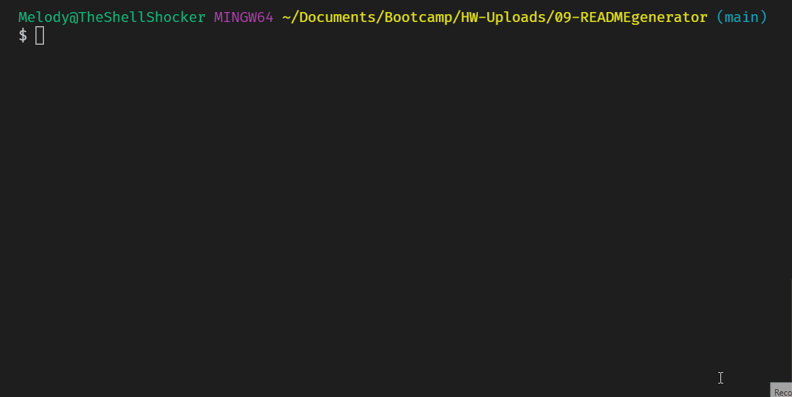

# READMEgenerator
- Answer a some questions in the command line and easily create a README in this node.js README generator.

[Video of Application](https://drive.google.com/file/d/1xq3J1ZU1RNXhkJohrqSIaFuDpN7gN32W/view?usp=sharing)

## Description
- This project will allow the user to easily build a readme from scratch much quicker than creating it manually.
- It solves the lengthy process of writing a README for every repo you make.
- I learned a lot about Node.js; module.exports; temporal literals; the inquirer package; and writing files.

## Table of Contents
- [READMEgenerator](#readmegenerator)
  - [Description](#description)
  - [Table of Contents](#table-of-contents)
  - [Installation](#installation)
  - [Usage](#usage)
  - [Credits](#credits)
  - [License](#license)
  - [Contributing](#contributing)
  - [Tests](#tests)
  - [Contact](#contact)

## Installation
1. Provided that you have a code editor of your choosing installed on your system, such as VS Code (https://code.visualstudio.com/),

2. Provided that you have a Terminal installed for Windows (https://www.microsoft.com/en-us/p/windows-terminal/9n0dx20hk701?rtc=1&activetab=pivot:overviewtab) or are using a Mac with Terminal installed with the OS,

3. Provided that you have npm and Node.js installed for windows (https://www.npmjs.com/get-npm).

4. You have Git and Github Desktop installed (https://git-scm.com/downloads, https://desktop.github.com/) and have registered for an account,

5. Either Clone or Fork this repository: (https://github.com/mmonyok/READMEgenerator.git),

6. Clone the repository to your local computer, and initialize npm, as well as install inquirer and request node modules. 

7. Edit in your code editor and continue to commit, push changes and perform other Git actions using your repository https://docs.gitlab.com/ee/gitlab-basics/start-using-git.html.

## Usage
- Open terminal in VS Code and enter {node index.js}.
- Answer all the prompts.
- Your new README and license will be generated into the demo folder.

## Credits
- Technologies Used:
  - [JavaScript](https://www.javascript.com/)
  - [Node.js](https://www.npmjs.com/get-npm)
  - [NPM](https://www.npmjs.com/get-npm)
  - [Inquirer Node Module](https://www.npmjs.com/package/inquirer)
  - [Request Node Module](https://www.npmjs.com/package/request)
  - [ScreenToGIF](https://www.screentogif.com/)

- Tutorials Followed:
[Professional README guide template provided by Coding Boot Camp.](https://github.com/coding-boot-camp)

## License
- MIT License

- Copyright (c) [2021] [Melody Monyok]

- Permission is hereby granted, free of charge, to any person obtaining a copy
of this software and associated documentation files (the "Software"), to deal
in the Software without restriction, including without limitation the rights
to use, copy, modify, merge, publish, distribute, sublicense, and/or sell
copies of the Software, and to permit persons to whom the Software is
furnished to do so, subject to the following conditions:

- The above copyright notice and this permission notice shall be included in all
copies or substantial portions of the Software.

- THE SOFTWARE IS PROVIDED "AS IS", WITHOUT WARRANTY OF ANY KIND, EXPRESS OR
IMPLIED, INCLUDING BUT NOT LIMITED TO THE WARRANTIES OF MERCHANTABILITY,
FITNESS FOR A PARTICULAR PURPOSE AND NONINFRINGEMENT. IN NO EVENT SHALL THE
AUTHORS OR COPYRIGHT HOLDERS BE LIABLE FOR ANY CLAIM, DAMAGES OR OTHER
LIABILITY, WHETHER IN AN ACTION OF CONTRACT, TORT OR OTHERWISE, ARISING FROM,
OUT OF OR IN CONNECTION WITH THE SOFTWARE OR THE USE OR OTHER DEALINGS IN THE
SOFTWARE.

## Contributing
- Please submit any contributions you think will improve this project.

## Tests
- No further testing is needed, unless any new contributions are made; the owner of this project will locally test any contribution submissions prior to approval.

## Contact
- Melody Monyok
  - <monyokwebdev@gmail.com>
  - (612) 492-1528