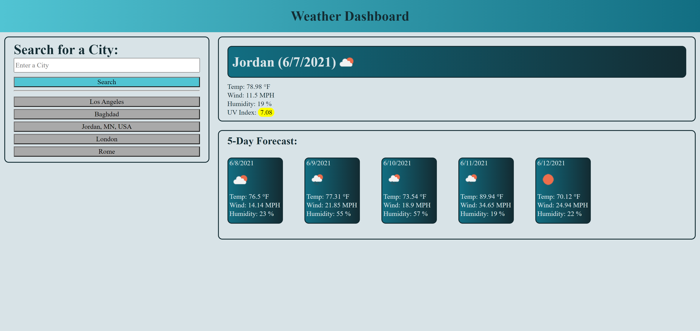

# 06-HW-weatherDashboard
- Check the local weather of any city!

[Live Site!](https://mmonyok.github.io/06-HW-weatherDashboard/)

## Description
- Understanding server-side APIs is an important part of any coding journey. Working with them on this project will go a long way in advancing my coding skills and knowledge.
- The changing weather and its patterns are an integral part of daily life for everyone. Knowing the current and future weather will help anyone make or change plans, depending on how the weather affects them. This webpage allows for one to check the current weather, as well as the weather for the next 5 days.
- Having a simple, convenient web page for checking local weather is valuable, as well as the fact that it is devoid of the plethora of ads you typically find on a classic search engine.
- This project helped me better solidy my JavaScript knowledge, especially when I switched to working predominantly in jQuery. I also learned a lot more about navigating server-side APIs, changing their parameters, and finding how to best manipulate them for my needs.

## Table of Contents
- [06-HW-weatherDashboard](#06-HW-weatherDashboard)
    - [Description](#description)
    - [Table of Contents](#table-of-contents)
    - [Installation](#installation)
    - [Usage](#usage)
    - [Credits](#credits)
    - [License](#license)
    - [Contributing](#contributing)
    - [Tests](#tests)
    - [Questions](#questions)

## Installation
- Provided that you have a code editor of your choosing installed on your system, such as VS Code (https://code.visualstudio.com/). Provided that you have a Terminal installed for Windows (https://www.microsoft.com/en-us/p/windows-terminal/9n0dx20hk701?rtc=1&activetab=pivot:overviewtab) or are using a Mac with Terminal installed with the OS. You have Git and Github Desktop installed (https://git-scm.com/downloads, https://desktop.github.com/) and have registered for an account. Either Clone or Fork this repository: https://github.com/mmonyok/06-HW-weatherDashboard. Create your own repository for the files on GitHub. Edit in your code editor and continue to commit, push changes and perform other Git actions using your repository https://docs.gitlab.com/ee/gitlab-basics/start-using-git.html.

## Usage
- Enter a city name in the search box. If you search with state, you must also search with country code, separated by commas. The current forecast, as well as the forecast for the next 5 days will be displayed. Recent city searches will be displayed below the search box; click on any of them to search that city again.

## Credits
Technologies Used:
- HTML, CSS, JavaScript, jQuery, & Open Weather Map (Current Weather Map API & One Call API).

## License
- GNU General Public License v3.0

- Copyright (C) [2021] [Melody Monyok]

- This program is free software: you can redistribute it and/or modify it under the terms of the GNU General Public License as published by the Free Software Foundation, either version 3 of the License, or (at your option) any later version.

- This program is distributed in the hope that it will be useful, but WITHOUT ANY WARRANTY; without even the implied warranty of MERCHANTABILITY or FITNESS FOR A PARTICULAR PURPOSE. See the GNU General Public License for more details.

- You should have received a copy of the GNU General Public License along with this program. If not, see <https://www.gnu.org/licenses/>.

## Contributing
- Please submit any contributions you think will improve this project.

## Tests
- No further testing is needed, unless any new contributions are made; the owner of this project will locally test any contribution submissions prior to approval.

## Questions
Please send any questions to the following:
- Melody Monyok
    - Email: (monyokwebdev@gmail.com)
    - GitHub: (https://github.com/mmonyok)